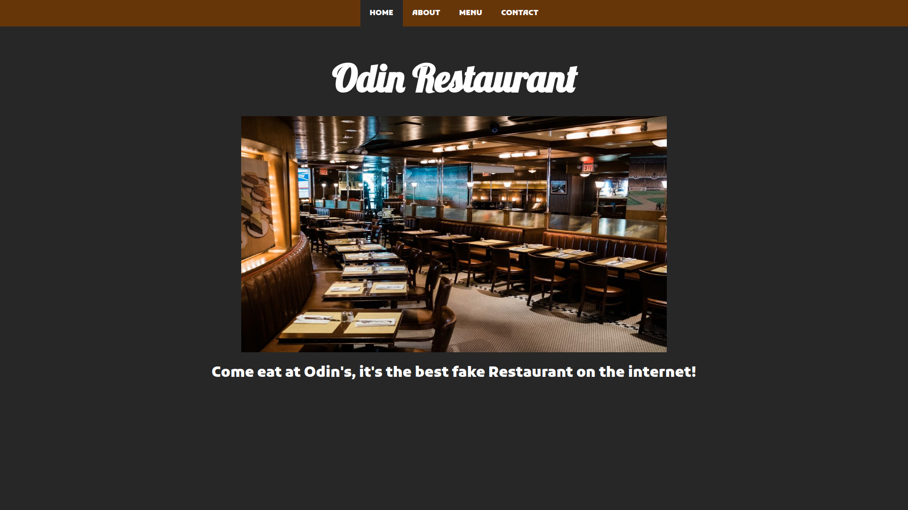

The purpose of this project was to practice with webpacker and npm, exporting and importing files.

Visit this project live at: https://jmart6784.github.io/odin-restaurant/

OR

Run the project locally:

1. Download or clone the repository.
2. Open index.html with your web browser